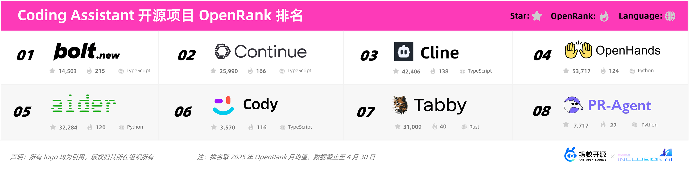

“当我们看到这些数据趋势的时候，一个词浮现在我的眼前——黑客松（Hackathon），AI 领域的项目，快速地出现、快速地停更，他们似乎在做一场真实市场里的黑客松，那么，什么领域涌现了最多项目，哪些方面是停更的重灾区，哪些项目幸存了，激烈竞争的项目们如今怎么样了，我们都尝试着在这份趋势报告里叙述一二。”

--王旭，蚂蚁开源技术委员会副主席

---

**「根据 OpenDigger 的数据显示，人工智能已经于 2023 年超越云原生，成为协作影响力最大的技术领域」**

从近十年来 AI、云原生、数据库、前端、操作系统这五大技术领域的发展曲线来看，AI 类项目在近些年得到了快速发展，尤其在 2022 年后发展迅猛。AI 项目影响力总值在 2017 年超越前端技术，2022 年后进入快车道，并且在 2023 年超越了已经在逐渐下降的云原生领域，成为影响力最大的技术领域。

## 大模型开发生态全景
春节期间，DeepSeek 再次引爆大模型开发生态，2025 年 2 月，GitHub Trending 周榜上一度有 **94%** 的开源项目都和 AI 有关。这个生态如此崭新，迭代速度也如此惊人，我们观察了近三个月的 GitHub Trending 榜单，**60%** 的大模型开发生态相关的项目是在 2024 年之后新兴出现的，甚至有将近 **21%** 的项目在近半年内才创建，当然，有来也有去，同样有大量曾经热门的项目没有等到我们发出这份报告的日子。

从蚂蚁开源团队的视角，我们希望从社区数据中了解当下大模型开发生态的演进全貌：有哪些新兴的趋势，以及趋势下最顶尖的项目有哪些。蚂蚁的开源团队其实不叫开源办公室（OSPO），而是叫“开源技术增长”，是蚂蚁的一个技术架构性团队，我们的一个工作目标就是“利用对开源社区的洞察来为蚂蚁的架构和技术的演进提供指引”。我们做的这样的全景图和趋势分析，也正是希望能依据对社区的洞察，指出哪些项目是最应该跟踪、使用、参与的，哪些方向是值得投入的，反之亦然。

开源开发世界的一个很大的优点是，我们可以从公开数据中看到开发者们的协作分布动向，以此模拟项目们在生态之中的关联关系和生态位置：也许是上下游合作关系，也可能是同生态位竞争关系。因此，在做这份全景图的一开始，我们选取了时下 AI 领域中大家最耳熟能详的一些项目（例如 PyTorch，LangChain，vLLM 等），把它们作为种子节点，然后通过开发者在 GitHub 上的不同项目之间产生的协作关联关系，不断去探查生态的多个侧面。在得到初始的项目列表的基础上，我们和一些相关领域的开发者们探讨，手动的维护项目所属的技术领域标签，并不断做列表的收敛和更新。AI 技术迭代一日千里，我们希望呈现的是当下最顶尖的和最火热的开源项目，所以，这里用到了华东师范大学 X-lab 实验室的 **OpenRank 影响力评价指标**作为一个重要的数据依据——**在今年的 OpenRank 月均值大于 10 的项目才会出现在全景图上**，一些年久失修，或者是过于崭新的项目，如果没有达到这个阈值，则会被拿掉。

OpenRank 地址：https://open-digger.cn/docs/user_docs/metrics/global_openrank

最终，呈现下面这张 **2025 年大模型开源开发生态全景图，**截止 2025 年 5 月发布时，全景图上收录了 **135 **个项目，涵盖了智能体应用层和模型基础设施层一共 **19** 个技术领域。虽然我们非常努力想从中挖掘更多信息，但我们也完全明白，社区的数据既不全面也不完全准确，而且也不一定能反映出很多最新最优秀的技术变化，我们只希望这个报告能给大家一些有益的参考，有什么错漏之处和其他值得补充的观点，也欢迎大家反馈给我们。

以下是本次全景图上所有项目中，在 **2025 年 OpenRank 排名 Top 20 **的项目详情：

结合这些项目的排名分布，再对比 2024 和 2025 年 OpenRank 的同比绝对值变化，可以看到三大主导的技术领域：**模型训练框架、高效推理引擎和低代码应用开发框架。**

+ **在训练上：PyTorch** 是当之无愧的生态顶流，在全景图中的所有项目中影响力位列第一。而国产的深度学习平台百度飞桨，对比去年同期 OpenRank 降低了 41%，绝对值降低 150；
+ **在推理上：** 高效推理引擎 **vLLM** 和 **SGlang** 在过去一年都处于飞速迭代之中，分别位于 OpenRank 同比增长的第一和第三位，他们以优越的 GPU 推理性能优势在企业级 LLM 部署中广受拥趸；
  
+ **在应用侧：** 结合低代码工具链和 RAG 知识检索管理技术的 **Dify **和 **RAGFlow**，由于契合企业快速构建 AI 应用的需求，正在迎接属于他们的高速增长，而这两个应用开发平台都是从中国开发者社区中生长出来的强势项目。

在观察了 100 多个大模型开发相关领域的开源项目之后，我们得到了一个暴论：

### 大模型开发生态是一场真实世界的黑客松（A Real-world Hackathon）
 

在 AI 技术扩散速度远超预期的背景下，**大模型开发生态正演变为一场在真实世界发生的、实时公开直播的黑客松。** 开发者借助 AI 的力量得以以“超级个体”的姿态，在热点事件中快速构建开源项目，通过技术能力争夺公共流量与行业话语权。与此同时， 一波又一波的开源项目和产品也在技术概念浪潮中爆火或者消亡。这种快速构建，快速消亡，注重开发速度的迭代，正如“几十个小时完成一款软件”的黑客马拉松（Hackathon）一般。

在观察和这张全景图相关的开源项目时，我们发现了一些有趣的故事，从侧面印证了上述观点：

### 开发者的短线投资与技术声誉
当 Devin、Perplexity、Manus 等闭源产品引发行业震动时，开发者们在短时间内迅速复刻出了开源版本：

+ **Devin 与 OpenDevin：** 在 Devin 发布的当月（2024 年 3 月），在 UIUC 计算机专业在读 PhD 的[王星尧](https://xwang.dev/)发起了 OpenDevin 项目，项目开源的次月，OpenRank 就飙升至了 190。后来，OpenDevin 改名为 OpenHands，并且成立了相应的商业化公司 All Hands AI，专注于做 AI 软件开发应用平台；
+ **Perplexity 与 Perplexica**：独立开发者 ItzCrazyKns 于 2024 年创建了 Perplexica 项目，作为热门的闭源AI 搜索引擎 Perplexity 的开源替代，迄今项目已经积累了 22K Star 的极高关注，但 OpenRank 始终不温不火地维持在 25 左右；有趣的是，在 Devin 发布的同时间，这位开发者也同步发起了一个更轻量的开源版本“[Not Devin](https://github.com/ItzCrazyKns/Not-Devin)”，如今也已经明确不再维护；
+ **Manus 与 OpenManus**：今年 3 月，Manus 刷屏的同时，MetaGPT 背后的创业公司 DeepWisdom 再次带来一场经典的“ 3小时复刻”，在 OpenManus 仓库创建的当天就获得了 8k Star。 

这些项目的生命力究竟如何，还需要时间验证（当然，有一些已经被时间验证），但开发者通过短期内获得的技术声誉实现了自身的长期价值 -- GitHub Star 数、社区讨论热度以及与头部机构的合作机会，成为衡量开发者“影响力资产” 的新指标，即便那些项目最终沉入 “AI 墓园”，开发者也能够凭借早期贡献获得行业认知的红利。

****

### AI “墓园” - 昙花一现的技术实验
LLM 浪潮同时催生了一批 “速生速死” 的 AI 项目和产品。在 Dang AI 收录的 5079 个 AI 应用工具中，有 1232 个已经停止维护，其中最容易被关停的产品类别是写作类工具。Dang AI 为这些昙花一现的产品们做了一个“[AI 墓园](https://dang.ai/ai-graveyard)”。

Dang AI 的 AI 墓园地址：https://dang.ai/ai-graveyard

在开源生态中，也不乏这样的项目，他们在创建后的短时间内获得了大量的关注，而如今已经不再活跃，我们为这些项目做了一个“开源 AI 墓园”（如下图）。这些项目均在 2023 年之后发起，拥有上万 Star 的关注度，除了 Swarm 是由 OpenAI 在今年 3 月官方宣布不再维护外，其余项目的上一次代码提交都还停留在 2024 年。

其中，比较有代表性的有两个项目：

1. 2023 年 4 月，个人开发者 Yohei 发起了 BabyAGI 项目，在很早期就提出了 “自我进化 Agent” 的设想，通过任务分解、学习反馈和动态规划模拟通用人工智能（AGI），可谓是最早的一波对 AGI 的想象；
2. 2024 年 2 月，OpenAI 发布了 Swarm，提出了 “群体智能”的概念，在发布时获得了极高关注度，被视为探索多智能体协作的前沿尝试，目前已经被产业可落地的 OpenAI Agents SDK 所替代，Swarm 则逐渐淡出公众视野。

这两个项目在发布时就声称是 “实验性”、“探索性” 的尝试，可以说在一开始就没打算做深谋远虑的长期规划。然而他们所提出的先锋概念，所激发的讨论和创新性尝试，在一起推动这场“黑客松接力赛”从概念验证向工程落地的演进。

### 模型能力对应用场景的冲击与重塑
随着模型能力的不断提升，应用开发生态也在随之发生变革，有冲击与挤压，但也带来了更多新的想象空间。

**AI Search 开源项目的式微**：AI 搜索是最早落地的应用场景，以 Perplexity 为代表的产品一度形成了对谷歌搜索的实质性挑战，而 Morphic.sh、Scira 等开源项目也试图通过本地化部署和 API 自由配置打破闭源产品的垄断。从发展趋势上来看，这类项目的存活率并不高。模型能力的泛化在加剧专用搜索工具的生存压力，GPT4、Gemini2.0 等新一代模型已经能够自主完成网络检索、信息整合和答案生成的全流程，这种内置的联网检索功能也许在压缩专用的搜索工具的市场空间；

**AI Coding 开源项目的火热：** 与之相对的，模型能力的提升正在引发软件开发范式的变革。Claude 3.7 Sonnet 在编码和 Web 开发方面的突出表现让 AI 辅助编程进入了一个新阶段。开发者通过自然语言描述场景，模型自主完成需求分析和代码实现的 “氛围编程”（Vibe Coding）开发范式已经悄然形成。现阶段，除了商业化产品 Cursor、Windsurf 等验证了市场热情外，以 Continue、Cline 为代表的 IDE 插件形态的项目们也是主流的开源选择，这两个项目的社区参与者人数都已经超过 3000 人，且 OpenRank 曲线持续攀升。顺便提一下，蚂蚁也在 2023 年开源了 AI Coding 平台 CodeFuse，从软件开发的全生命周期辅助开发者进行 AI 原生的软件开发，虽然本次没出现在全景图上，但还是欢迎大家关注。

### 生态位之间的动态博弈

从整体格子的变化来看，生态位之间也在进行动态的博弈。

+ 在增长的两端分别是以 Dify 为代表的应用平台和以 LangChain 为代表的应用开发框架。不同开发模式表现出的 “冰火两重天” 态势，也是该生态极快迭代与极强生命力的体现。此处要特别提一下本次唯一出现在全景图上的、由蚂蚁发起的开源项目 DB-GPT，它是一个结合了“AI 应用开发” 和“大数据应用”两个场景的 Agent 开发平台，精准的定位和精准的出击，让项目在 2023 年一经推出就吸引了大量高校和产业界的开发者们参与共建。
+ DeepSeek-R1 推理模型带来的 "Aha Moment" 证明了强化学习这一后训练路径的有效性，以 Verl，OpenRLHF 为代表的强化学习框架在今年显著增长。在今年 2 月份，inclusionAI 也全面开源了强化学习框架 AReaL，旨在训练每个人都可以复现和贡献的大型推理模型，当然，项目还很新，让我们期待下一次它能够出现在全景图上。
+ 生态之间也在彼此摸索能力的边界。例如，向量化的存储、计算和检索是作为大模型应用接入领域知识的重要一环，一度给 Milvus、Qdrant 等垂类的向量数据库带来“泼天的流量”，而传统大数据系统也纷纷做向量化转型，蚂蚁的开源分布式数据库 OceanBase 也在去年支持了向量存储功能，并且同步兼容了 Milvus 的 API。我们可以看到，技术的边界在不断的流动和融合中保持着微妙的生态平衡。

## 大模型开源开发生态技术趋势观察
在生态全景之外，我们选取了当下热门的七大趋势，基于社区数据进行了趋势分析、行业观察，并且比较大胆的做了一些趋势论断。这些趋势包括了在大模型时代新兴出现的生态，例如以应用层为主的 Agent 开发框架，以 MCP 为代表的 AI 原生标准协议，改变了软件开发模式的 Coding Agent；也包括了发生在传统的大数据和人工智能领域的生态，它们在大模型时代也发生了一些转向，有些领域一度被显著地波及，例如向量化的存储，也有些领域发生了生态格局的颠覆，例如模型的推理服务。

### 2025 年，Agent 框架热潮褪去

2023-2024 年间，以 LangChain 为代表的"全能型"框架凭借其开创性的任务编排能力和丰富的工具集成一度主导市场，在此期间也涌现出了一大批新的 Agent 开发框架，无论是主打工具调用、RAG 接入、长上下文记忆、ReAct 规划，无数的智能体开发框架在不同的技术概念和浪潮下迅速崛起；到 2024 年下半年，格局初步形成，已经少有看到新的开发框架出现，热潮褪去之后，我们看到早期主导市场的 LangChain 因为陡峭的学习曲线和复杂的调试成本在明显的走向下坡；进入 2025 年，格局呈现出分化的趋势：**Dify、RAGFlow 等平台通过低代码工作流和企业级服务的落地开始主导市场；而以 LangChain 和 LlamaIndex 为代表的开发框架日渐式微。**

作为当前最热门的 AI 应用开发平台，Dify 精准把握了企业级用户的需求：一方面通过直观的可视化工作流编排大幅降低技术门槛，另一方面则提供完善的企业级安全管控方案。**AI 应用开发者们并不缺乏新的选择，易用性、快速构建或许是当下应用开发框架的关键标签。**在下表中，我们对比了当下三大主流框架的功能特性：

| **功能/特性** | **Dify** | **n8n** | **RAGFlow** |
| :--- | :--- | :--- | :--- |
| 工作流编排支持 | ✅ 提供可视化AI工作流编排，支持将复杂任务拆解为节点  | ✅ 提供可视化通用工作流编排，可拖拽节点构建自动化流程  | ⚠️ 部分支持：专注于RAG流程，有Graph图式工作流用于检索流程 |
| 可视化界面 | ✅ 带有网页可视化“画布”界面，可在上面构建和测试AI流程  | ✅ 带有网页可视化流程编辑器构建流程，所见即所得。 | ⚠️ 有限：提供Web界面用于上传文档和对话，但无通用流程设计界面。 |
| AI/LLM 集成 | ✅ 深度集成各类LLM，大量模型支持（数百种模型/数十推理服务商）  | ✅ 内置AI节点，支持LangChain等，可调用OpenAI等模型 ；支持自定义代码节点调用任意模型API。 | ✅ 集成LLM用于问答，支持多种大模型提供商；模型可配置切换。 |
| 文档/RAG 管道 | ✅ 内置RAG管道，从文档摄取到检索全流程，支持PDF、PPT等格式文本自动解析 。 | ⚠️ 间接支持：无内置RAG模块，但可通过节点组合实现检索+问答（如向量数据库节点+AI节点）。 | ✅ 专为检索增强生成设计，深度文档解析（OCR、结构提取等）+检索+引用；提供可靠带引用的问答 。 |
| Agent智能体 | ✅ 支持基于LLM函数调用或ReAct的Agent框架，可添加预构建/自定义工具；内置50+工具（如Google搜索、DALL·E、WolframAlpha等）。 | ✅ 支持AI Agent流程，可结合LangChain代理调用外部服务 ；也可通过HTTP节点调用任意API实现Agent行为。 | ⚠️ 基础支持：引入“Agentic RAG”概念，可在检索流程中加入外部搜索（如Wiki、PubMed等算子）；但不提供通用Agent工具框架。 |
| 数据处理能力 | ⚠️ 偏重文本：侧重AI应用相关的数据（提示、向量等）处理，支持数据集ETL和模板转换节点等；不以通用ETL为目标。 | ✅ 强大：可处理各类数据，支持格式转换、过滤、延时等操作节点，以及代码节点实现复杂逻辑。 | ⚠️ 专用：聚焦文档解析处理（版面分析、表格结构提取等）；不适合作为通用数据管道，仅针对知识库构建优化。 |

随着 AI 技术逐渐成熟，框架的竞争焦点已经从单纯的技术创新转向对企业实际业务场景的深度适配。那些能够提供完整企业级解决方案（包括权限管理、审计追踪、数据隔离等特性）的平台，正在获得越来越多企业用户的青睐。可以预见，未来 AI Agent 框架的发展将呈现"马太效应"：功能完善、生态健全的平台将吸引更多企业用户，而这些用户的反馈和需求又将进一步推动平台优化，形成正向循环。在这一过程中，像 Dify 这样既保持技术领先又深入理解企业需求的项目，很可能会持续扩大其市场优势。

### 标准协议层：兵家必争的战略要塞

**2022 年，ChatGPT 兴起**，早期的大模型应用开发者借助在 Prompt 中附上函数说明，来试图进行工具调用，使模型和外部世界交互。这种实现方式五花八门，效果也不尽人意；

**2023 年，OpenAI 在发布 GPT4-0613 模型时同时推出了函数调用（Function Calling）功能**，初现标准的端倪；由于函数调用过程需要开发者来完成，因此生成过程中多个函数的协同和编排都成为了难题，而且在现有工具中集成新的函数也极为困难，扩展性受到极大的限制；

**2024 年 11 月，Anthropic 开源了模型上下文（Model Context Protocol，MCP）协议**，标准化了智能体与工具之间的通信。3 月起，各个大模型都快速跟进并支持了 MCP，由此 MCP 也成为了目前实现大模型 Agent 调用外部工具资源的事实标准；

**2025 年 4 月，Google 开源了智能体间协议（Agent2Agent，A2A） 协议**，该协议与 MCP 不同，并不是约定如何为大模型实现一个 Agent，而是规定不同的 Agent 应用之间如何进行交流和互操作；

**2025 年 5 月，CopilotKit 推出智能体用户交互（Agent-User Interaction，AG-UI）协议**。推出仅一周，[仓库](https://github.com/ag-ui-protocol/ag-ui)涨星 2.2K，该协议用于标准化智能体后端调用的工具和前端用户界面之间的交互层。

从 MCP、A2A 到 AG-UI 的陆续出现，我们可以想见，未来大模型应用会逐步向微服务化演进，即具有特定功能的 Agent/MCP 将成为互联网上独立发布并可被随时调用的服务，或者是以标准配置的形式发布以方便开发者或用户随时本地构建和启动服务。这种演进路径一方面面临传统微服务的技术挑战：如参数配置、版本管理、安全鉴权、数据隐私、服务编排等，但也引入了大模型特有的新命题：如 GPU 弹性调度、上下文跨节点共享与协同推理、多模态协同合作、Prompt 注入防御、输出内容合规审查、精细化多维计费、配额智能管理等。

面对上述的各种挑战，在技术标准层面，可能部分沿用现有技术标准，但更需要**原生协议创新**—— 例如定义大模型服务专属的元数据规范、流式通信协议、多模态交互协议、服务监控协议、联邦推理协议等。而在实践层面，开源生态将成为关键战场：主导标准制定的先行者可通过协议制定权的优势进一步绑定开发者工具链（如框架、SDK 等），进而形成从接口规范到运维实践的完整技术闭环，最终在模型即服务（MaaS）时代构筑生态护城河。

随着大模型服务的加速演进，**标准协议层也会成为头部玩家的战略要塞**，在可见的未来一到两年，标准协议层可能迎来密集的生态卡位战，而那些深度融合**技术前瞻性**与**开发者体验**的协议框架将逐渐占据生态话语权，并引导大模型技术领域创新的规模化涌现。

### 口嫌体直的 Vibe Coding 新范式

程序员会率先被 AI 取代吗？再往前几个月，这样的问句频繁出现。当 GitHub Copilot 帮助做代码自动补全时，开发者们产生了存在主义危机；当 AI IDE 们直接上手创建完整的工程项目时，真香定律上线，氛围编程（Vibe Coding）成为当代的软件开发新范式。

在调研了无数火热的 AI 开发类闭源产品，并观察了如下流行的开源项目之后，我们发现：

**大厂在 AI Coding 领域快速下场，但几乎以闭源为主。** 这其中主流的有 GitHub Copilot、Amzon Q developer、CodeArts Snap（华为）、通义灵码（阿里）、Trae（字节）、 CodeFuse（蚂蚁）。大厂的天然优势是有可以快速迭代的内部落地场景，短板则来自于对内部数据的过度依赖而导致的泛化能力不足，以及复杂的内部流程可能会阻碍创新速度。由此可见，大厂做辅助编程类工具，乃至做 AI 开发工具，有优势也有掣肘。

**反而是一些创业公司或三五人的小团队能够快速产出一个该领域的开源项目，迅速出圈。** 比如创业公司 Continue 的“[**continuedev**](https://github.com/continuedev)”开源项目，凭借小团队的高效协作和灵活的创新机制，迅速在开源社区获得关注。在与 OpenAI 或 Google 等行业巨头竞争时，AI Coding 赛道是少数几个不会因数据或场景资源匮乏而处于明显劣势的领域。5月初，OpenAI 甚至计划用 30 亿美元收购 AI 开发工具 Windsurf。

根据项目的智能化程度以及目标受众群体的专业化程度，我们将这些 GitHub 上热门的 AI Coding 类开源项目划分为四个象限：

可以看出，**AI Coding 正在尝试从一次性代码生成走向真实的软件工程场景下的开发，但依然面临很大挑战。** 尽管当前明星项目（如 Continue、Cline）在代码补全和简单 API 调用场景取得显著进展，但距离实现真正的 Dev Agent 仍存在本质差距。

现有系统在语义等价性验证、多语言项目协同、安全敏感代码生成等维度存在明显短板，尤其在处理包含复杂业务逻辑的大规模代码库时，重构成功率低于预期。技术演进的关键在于突破上下文感知能力（Context-Awareness）与领域知识融合（Domain Knowledge Integration）的双重瓶颈。预计未来 24 个月内，随着代码验证技术（如形式化方法与符号执行的结合）、多模态训练数据（代码+文档+运行时日志）的成熟，以及开发者反馈闭环的优化，AI 开发助手将会承担更多常规开发任务，但仍需人类开发者在关键决策点进行监督。

当我们看到上述这些当下热门的项目时，或许还会记得 Devika、TabNine、GPT-Pilot 这些逐渐沉寂的项目。它们日薄西山的原因背后，也反映了 AI 开发领域的市场分化：已经成熟的商业产品（Copilot、Devin、Cursor 等）和开源工具瓜分了市场，功能同质化或迭代缓慢的项目（如 Devika、GPT-Pilot）难以生存，而像 GPT Engineer这样早期积累了大量用户的明星开源项目，也通过开源的成功实践而发展为闭源的商业化产品：开源项目 GPT Engineer 作为热门的 AI 应用构建产品 Lovable 的前身，由于背后团队注意力的转移，如今已经不再继续维护。

### 向量索引与存储的技术边界流动

如果形容向量数据库的发展，可以说是 **“起于泼天的富贵，回归理性的沉淀”**。 2023 年 2 月前后，以 Qdrant，Chroma 为代表的项目收到了一波极其夸张的关注，分别收获了超过 5000 的 Star 数，但这种高关注**并未形成持续的趋势**。

在 2024-2025 年的整体发展期，我们看到各个项目新获得的关注整体趋于稳定，没有出现很大的差异；在 OpenRank 趋势上，开源较早并且由 LF AI & Data 基金会中立托管的 Milvus 在一直保持着稳定的领先，而整个技术领域似乎像是平行的跑道，一起平稳的向前发展。

**这种状态的背后的原因有几个关键的可能性：**

1. **开源产品并非唯一的市场选择**：同期有纯商业版的强力竞争者如 Pinecone，KDB.AI 出现，且 Pinecone 的产品力和市场拓展相当不错；
2. **传统大数据系统的向量化升级：** 随着时间的推移，传统数据库开始推出向量化的插件或向量搜索引擎（如图中的 pgvector），这当中包含了大量很受欢迎的 DB 选型，如 PostgreSQL，MongoDB Atlas，OpenSearch，ElasticSearch 等，这对于纯粹的向量数据库带来了一些冲击；
3. **OpenCore 模式下，商业公司不那么关心 Core 的数据活跃：** 正如传统数据库有大量的项目是通过「开源核心」的方式来做商业模式，向量数据库也是类似。而这种模式下，有一个可用完整的开源核心非常重要，但核心的整体活跃度并不是背后的商业公司最关注的事情，基于 Core 版本形成的有竞争力的生态才是。  

**这带来了另一个讨论：**

**向量数据库是不是一个“冗余技术”？** 是否用传统数据库结合向量搜索中间件就可以满足模型应用的需求场景？

+ 答案是没有。社区数据显示，pgvector 的趋势处于不升反降的状态。由于模型规模极大，且主要在大中型公司中部署，可扩展性和企业服务能力是刚需，而目前的向量数据库基于开源的商业产品如 Zilliz 等都具备很好的横向扩展能力、云兼容能力、安全性、以及对于现有 AI/ML 框架的系统化支持。相应的商业服务在市场上比较受欢迎，而单纯的向量搜索引擎目前做不到这种服务能力。

从 vLLM 和 SGLang 的发展也能看到，**技术“薄”不是问题，有没有迭代空间和范式变化可能才是最大的问题，向量的需求，场景和算法都比较具体**，开发层面可能并没有那么大的想象空间；另一方面，**非结构化数据虽然数据量在增加，但更好的解决方案，多模态模型或生态玩家还没有形成规模**，从而导致向量层要解决和优化的迭代发展相对较为缓慢和稳定。

与 Agent 等应用层的“生死时速”不同，在向量数据库层面，前浪还没有被拍到沙滩上。

### 多模态数据治理在大模型时代的技术演化

数据湖技术是在大数据时代就已经提出的，对多模态的数据进行存储、检索和预处理的能力，而数据目录解决了在数据湖和湖仓一体架构中对海量、多样化数据资产的统一管理需求。在大模型时代，大家常说，重要的是数据、数据、还是数据。那么，这些面向多模态和多源的数据进行治理的开源技术与项目们，在这一波浪潮中，社区发生了怎样的变化？

****

**数据湖表格式方面，** Apache Iceberg、Apache Hudi、Apache Paimon、Delta Lake 共同构成了湖仓技术生态的“四足鼎立”。Iceberg 巩固了开源湖仓的通用框架，Hudi 和 Paimon 则在实时增量领域各展所长，Delta 凭借厂商支持稳步前进。可以预见，这些项目将彼此竞争又互相借鉴，推动数据湖存储技术不断进化，为非结构化海量数据的可靠管理提供支撑；

**元数据治理与数据目录方面**，OpenMetadata 和 DataHub 稳居一线，功能日臻完善；与此同时，Apache Gravitino 和开源版 Unity Catalog 等新秀异军突起，预示着下一代统一数据与 AI 治理平台的雏形正在形成。值得关注的是，它们纷纷将目光投向非结构化数据和 AI 资产，也顺应了大模型时代对广义数据治理的需求。  

从全景图上所有项目所构成的生态协作网络上，我们可以看到大数据系统领域的这些项目们还处在整个大模型开发生态相对边缘的位置，这可能跟大数据生态下的开发者们，本身就不像 AI 生态那样密集地产生交集有关。但也从一个侧面体现出，大数据和 AI 生态的融合还在路上。在未来，随着基座模型进一步融入数据基础设施，这些项目之间的联动也许会更加紧密，无论是大数据项目为机器学习任务提供高质量的数据，还是利用模型的能力反向的支持数智化的数据治理。

### 模型服务部署与推理的混战仍在持续

随着大语言模型的大规模部署，模型推理效率、资源利用率和部署灵活性成为影响应用落地的关键因素。2023 年以来，出现了一大波面向于模型部署和高效推理的大模型服务工具，在性能和生态上彼此追赶，混战一直持续到今天。从 Top 10 的模型服务项目的排名变化上来看，仍有新的项目不断冒出来，并吸引开发者参与到其中去。例如去年 7 月清华推出的 KTransformers 和今年 3 月 NVIDIA 推出的 Dynamo。

而无论是从排名还是从发展势头上，**vLLM 和 SGLang 都可谓是当下大模型领域最著名、热度最高的两个推理引擎，也都是 DeepSeek 推荐使用的推理引擎**。从 OpenRank 的趋势来看，vLLM 与 SGLang 的社区仍在持续扩张。2024 年第四季度，vLLM 的增长一度趋于停滞，而同期 SGLang 正在快速迭代，其 Q4 OpenRank 平均增速达 12%。进入 2025 年后，vLLM 发布了 v1 重大版本，完成核心架构升级，重新进入增长通道。推理引擎生态似乎由此开启了新一轮“军备竞赛”：2025 年第一季度，vLLM 的 OpenRank 平均增速为 17%，SGLang 则高达 31%。

继 Ray 和 Spark 之后，UC Berkeley 又一次展示了其强大的顶尖开源技术的孵化能力：vLLM 诞生于 UCB SkyLab，和 Spark、Ray 是一脉相承；SGLang 则诞生于 UCB 和多家大学共同发起的研究性组织 [LMSYS](https://lmsys.org/)，从官网上可以看到，这个组织还开源了火爆的大模型对抗式评测平台 Chatbot Arena。

**vLLM 和 SGLang 的社区对比**

|  | **vLLM** | **SGLang** |
| --- | --- | --- |
| **项目影响力（OpenRank）** | 2025 年均值：615 2025 年增速：17% | 2025 年均值：269 2025 年增速：31% |
| **发起组织** | SkyLab，UC Berkeley | LMSYS，一个由 UC Berkeley，Stanford，CMU 多家大学共同发起的开放式研究性组织 |
| **重要开发者** | [DarkLight1337](https://github.com/DarkLight1337)，HKUST [youkaichao](https://github.com/youkaichao)，清华 [WoosukKwon](https://github.com/WoosukKwon)，UCB | [merrymercy](https://github.com/merrymercy)，xAI [zhyncs](https://github.com/zhyncs)，Baseten [zhaochenyang20](https://github.com/zhaochenyang20)，UCLA |
| **开发者分布** | 美国（33.2%），中国（30.8） | 中国（49.2%），美国（27.5%） |
| **社区规模** | 贡献者：449 参与者：12332 | 贡献者：1134 参与者：2232 |

但模型服务这条赛道上，并不只有 vLLM 与 SGLang。

+ **Ollama 与 llama.cpp：端侧推理和本地部署的轻量级优选。** 使用 llama.cpp 进行模型训练、量化和性能调优，再通过 Ollama 进行快速部署和服务化管理是开发者中的一种常见实践。这两个项目不仅仅是在模型服务赛道最近一个月的排名上位列第 3 和第 4，从整个生态的排名来看，也占据不可忽视的头部位置。  

+ **KTransformers：超大规模参数场景下的异军突起。** 2025 年 2 月，清华大学 KVCache.AI 团队推出的 KTransformers 宣布成功在 24 GB 显存 + 382 GB 内存的 PC 上实现本地运行 DeepSeek-R1、V3 的 671B 满血版，并且[据说](https://github.com/kvcache-ai/ktransformers/issues/832)速度提高了 3~28 倍，项目随即迎来社区爆发式增长。当月项目 OpenRank 飙升 34 倍，吸引了 736 名开发者参与协作与讨论，仓库 Star 数突破 1 万。

### 以 PyTorch 为核心的训练生态

PyTorch 是如今大模型开发生态的绝对顶流和生态核心，也是模型训练领域当之无愧的事实标准。凭借模块化和轻量化的开放设计，在 2020 年正式超过了 TensorFlow，成为大模型时代深度学习的基础设施，而 TensorFlow、MXNet、Caffe 等框架已经成为了上一个时代的过去式。

2022 年 9 月，Meta 宣布将 PyTorch 以独立基金会的形式归入 Linux 基金会（LF）旗下运作，成立 PyTorch 基金会。凭借 PyTorch 近乎“蛮横”的生态虹吸效应，这个子基金会现在也发展成为强大的伞形组织：今年 3 月份，[推理引擎 SGLang 加入 PyTorch 生态](https://pytorch.org/blog/sglang-joins-pytorch/)；5 月份，推理引擎 vLLM 和分布式训练平台 DeepSpeed 也[宣布加入 PyTorch 基金会](https://pytorch.org/blog/press-release-pytorch-foundation-expands-welcomes-projects-vllm-deepspeed/)。

虽然以中立的、独立基金会的形式治理 PyTorch 项目生态的发展，我们依然能够从社区数据中看到 Meta 在其背后产生的巨大影响力，仓库中有几位头部贡献者：[ezyang ](https://github.com/ezyang)（提交 3280 次）， [jerryzh168](https://github.com/jerryzh168)（提交 1216 次），[soumith](https://github.com/soumith)（提交 1151 次），在 GitHub 首页都可以找到是 Meta 员工的证明。截止报告发出时，仓库中有 9000 多个带有 _fb-exported_ 标签的 PR（占所有 PR 数量的 9%），推测是由 Meta 内部系统开发和评审之后，再对外和 GitHub 做同步时的产物。

## 发布前的一周，还发生了什么？
黑客松最重要的事情就是快速响应，所以报告的最后一部分，我们给发布之前的一个星期留了位置，而上一周，各个厂商也给我们这最后一块留白做足了面子，通过三场“科技春晚”带来了一系列升级和发布——

+ 微软 Build 2025 大会上，Windows 操作系统原生支持模型上下文协议（MCP）；VSCode 开源 GitHub Copilot Chat 插件，推动 AI 编程发展；
+ Google IO 2025 大会上，Gemini 全系列更新闪亮登场，同时，Gemini 系列应用也全面升级，正在成为一个 “AI 操作系统”，将被整合到安卓各种设备和 Chrome 浏览器里；
+ Anthropic Code with Claude 2025 大会，Claude 4.0 发布，带着最强编码模型的光环，开发者们开始了新一轮的黑客松。

这一周，又该轮到谁了？

## 致谢
本期洞察从蚂蚁作为一家科技企业的视角出发，深度使用到了 X-lab 开放实验室的 OpenRank 评价指标，期间也咨询了很多来自蚂蚁内部的技术专家和开源社区的开发者们，非常感谢大家的宝贵观点。后续，我们也会将内容开放在 GitHub 上，欢迎大家共同协作，一起贡献高质量的生态洞察。

本篇作者：夏小雅，边思康，董超，王旭（蚂蚁开源）；赵生宇，韩凡宇，彭佳恒，张震，王伟（X-lab 开放实验室）

