**「AI Surpasses Cloud Native as the Most Influential Tech Domain」**

According to [OpenRank](https://open-digger.cn/docs/user_docs/metrics/global_openrank) data from [OpenDigger](https://github.com/X-lab2017/open-digger), AI surpassed Cloud Native in 2023 to become the most influential technology domain in terms of community collaboration on GitHub. Looking at the growth curves of the five major tech domains (AI, Cloud Native, Database, Frontend, and Operating System) over the past decade, AI projects have seen rapid growth, especially after 2022. AI’s total influence score overtook Frontend technologies in 2017, accelerated post-2022, and surpassed the declining Cloud Native in 2023 to claim the top spot.

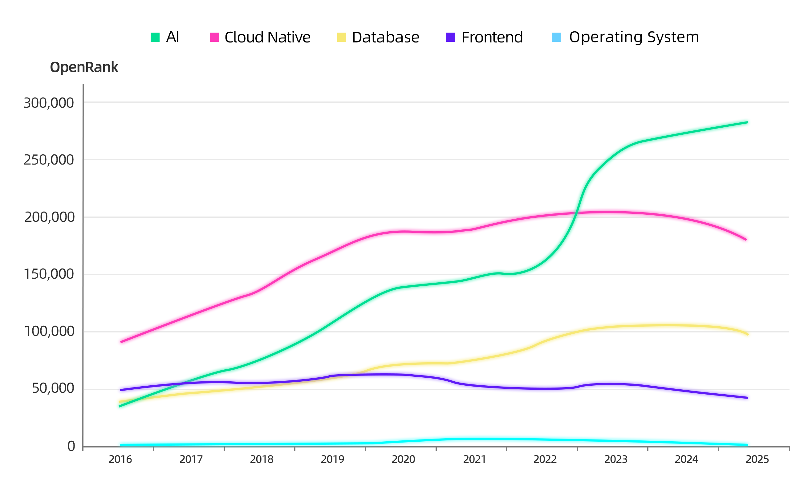

## The LLM Development Ecosystem: A Snapshot

In February 2025, DeepSeek sparked a surge in the Large Language Model (LLM) development ecosystem. GitHub’s Weekly Trending List reached a peak on that month where **94% of the listed repositories were AI-related**. This ecosystem is incredibly new and is evolving fast. Over the past three months, we observed that 60% of LLM-related projects appeared on GitHub Trending were emerged after 2024, and nearly 21% were created in just the last six months. That said, these violent delights have violent ends. We also observed that many once-popular projects faded into the void before this published report as the victims of the blazingly fast iterative speed.

One of the key advantages of the open-source development ecosystem is that we can analyze collaboration patterns and dynamics among developers through public data, enabling us to model relationships and ecological positions of projects, regardless if they are upstream-downstream partners or competitors in the same niche. This provides a fundamental basis for building a data-driven open source landscape.

We build the landscape by first selecting well-known AI projects (e.g., PyTorch, LangChain, vLLM) as seed nodes. By analyzing developer collaboration relationships across "related" GitHub projects, we explored multiple facets of the ecosystem and generated the "initial project list". Based on the initial project list, we collaborated with developers in relevant fields to manually maintain technical domain tags and then iteratively refine the list, until it reaches critical mass.

Given the rapid iteration of AI technologies, this report aim to highlight cutting-edge and highly active open-source projects up to the time of authoring. To achieve this, we rely on the OpenRank influence metric developed by the X-lab at East China Normal University as a core criterion: only projects with an **average monthly OpenRank score exceeding 10 in year 2025** are included in the landscape. 

As of May 2025, the Open Source LLM Development Landscape 2025 presented above includes 135 projects across 19 technical domains, spanning both Agent application layers and model infrastructure layers. While we have made significant efforts to extract deeper insights from this data, we are fully aware that community data is neither comprehensive nor entirely accurate, and may not fully reflect emerging or exceptional technological advancements. This report aims to provide valuable inspirations rather than definitive conclusions. We welcome feedback on any omissions, inaccuracies, or additional perspectives to further enhance and improve this work.

Below are the details of projects that are ranked in the Top 20 of OpenRank among all the projects in the landscape:

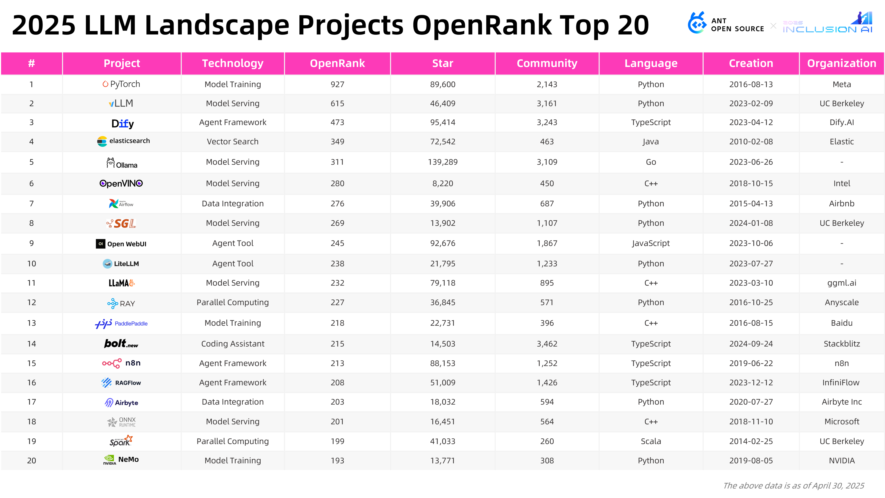

By stack ranking the year-over-year absolute changes in OpenRank between 2024 and 2025 and cluster based on technical domains, we converged 3 key observations:

+ **Model Training Frameworks**: PyTorch remains the undisputed leader in the ecosystem, ranking the top in OpenRank among all projects in the overall landscape. Meanwhile, Baidu's PaddlePaddle, a popular Chinese deep learning platform, saw a 41% drop in OpenRank compared to the previous year, with an absolute decrease of 150 points.
+ **Efficient Inference Engines**: The high-performance inference engines vLLM and SGLang have undergone rapid iterations over the past year, ranking the first and the third in OpenRank value growth, respectively. The superior GPU inference performance made them the most popular choices for enterprise-level LLM deployment.
+ **Low-Code Application (aka Agent) Development Frameworks:** Agent platforms like Dify and RAGFlow, which integrate RAG-based knowledge retrieval and management, are experiencing rapid growth as they meet the red-hot demand for quickly building AI applications. Notably, both platforms are strong projects emerging from China’s developer community.

After observing over 100 open-source projects in the field of large model development, we’ve reached a pivotal point to make a bold claim: 

  

Developers, empowered by AI, are now operated as "super individuals" to rapidly building open-source projects around trending topics. They leverage their technical skills to create high caliber open source projects which capture public attention swiftly. On the other hand, we see projects fade into obscurity as they couldn't keep up with the developer expectations, or took the wrong path. This cycle of rapid creation and dissolution, driven by a focus on speed and iteration, mirrors the essence of a Hackathon, where we build software in limited time from several hours to several days.

We have several key observations around the hackathon:

### We keep seeing developers building OSS clones for rapid adoption
When closed-source projects like Devin, Perplexity, and Manus brought shockwaves to the industry, we see developers quickly replicated open-source versions:

+ **Devin & OpenDevin**: In March 2024, shortly after Devin’s release, Xingyao Wang, a PhD candidate at UIUC, launched OpenDevin. Within a month, its OpenRank skyrocketed to 190. The project was  rebranded as OpenHands, and then evolved into All Hands AI, a commercial venture company focusing on AI software development platforms.
+ **Perplexity & Perplexica**: Independent developer _ItzCrazyKns_ created Perplexica in 2024 as an open-source alternative to the popular closed-source AI search engine Perplexity. While it amassed 22K GitHub stars in a short time window, its OpenRank plateaued around 25 and flattened hereafter. Interestingly, the same developer launched a lighter version, “Not Devin,” around Devin’s release timewindow, but failed to gain the same level of traction. The project was then abandoned.
+ **Manus & OpenManus**: In March 2025, as Manus went viral, DeepWisdom, the company behind MetaGPT, pulled off a classic “3-hour replication” with OpenManus, which garnered 8K stars on its first day of repository creation.

The longevity of these projects remains to be seen (some have already faded), but developers gained significant technical reputation in the short term. Metrics like GitHub stars, community engagement, and collaborations with leading institutions have become new benchmarks for developers' “influence capital.” Even if these projects end up in the “AI Graveyard,” developers still benefit from early contributions through industry recognition.

### Ephemeral technical experiments often end up in the AI graveyard
While game of life thrives in open source communities, we've observed both prosperity and terminations. Out of 5,079 AI tools recorded and cataloged by Dang AI, 1,232 have been archived / abandoned. Dang AI even created an “[AI Graveyard](https://dang.ai/ai-graveyard)” to capture those projects once under the spotlight but eventually disappeared into the void.

The same was observed in open source ecosystem. We’ve curated an “Open-Source AI Graveyard” for projects that gained massive attention upon launch but became inactive overtime. All these projects were launched after 2023 and almost all gained tens of thousands of GitHub stars. While OpenAI officially discontinued Swarm in March of this year, the remaining projects’ latest code commits remained frozen in 2024. 

Two of the most interesting projects in this list are:

+ **BabyAGI**: Launched in April 2023 by individual developer Yohei, it pioneered the concept of “self-evolving agents,” simulating AGI through task decomposition, learning feedback, and dynamic planning. The project was way ahead of its time as the model basic capability was lukewarm. 
+ **Swarm**: Released by OpenAI in February 2024, it introduced the idea of “swarm intelligence” and was hailed as a groundbreaking exploration of multi-agent collaboration. However, it’s since been overshadowed by the more practical OpenAI Agents SDK.

Both projects were explicitly experimental, almost never intended for long-term planning. Yet, their bold concepts and the discussions they sparked have propelled the “Hackathon relay race” from proof-of-concept to practical implementation.

### Model capabilities was reshaping application scenarios
As model capabilities evolve, the application development ecosystem is undergoing transformation—bringing both disruption and new opportunities.

**The decline of AI Search projects**: AI search was one of the earliest applications, with products like Perplexity posing a real challenge to Google. Open-source projects like Morphic.sh and Scira attempted to break the monopoly with localized deployments and customizable APIs. However, their survival chances were low. The generalization of model capabilities, such as GPT-4 and Gemini 2.0, which can autonomously handle web retrieval, information synthesis, and answer generation, is squeezing the market for specialized search tools.

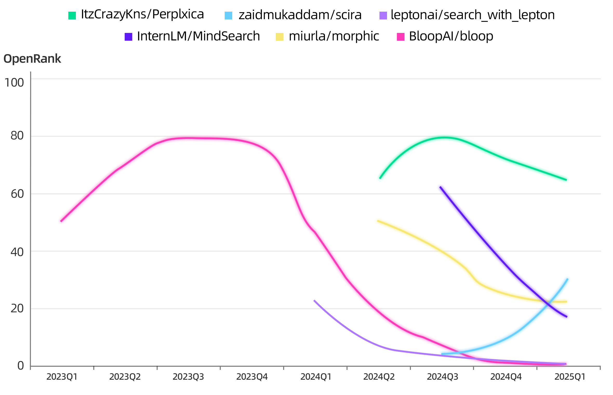

**The rise of AI Coding projects**: On the other hand, advancements in model capabilities are revolutionizing software development. Claude 3.7 Sonnet’s prowess in coding and web development has ushered in a new era of “Vibe Coding”, where developers describe scenarios in natural language, and models autonomously handle requirements analysis and code implementation. Other than commercial products like Cursor and Windsurf, IDE plugins like Continue and Cline are thriving open-source options, each with over 3,000 community contributors and steadily rising OpenRank scores. On a side note, Ant Group also open-sourced an AI coding platform, [CodeFuse](https://github.com/codefuse-ai), in 2023. It supports developers throughout the entire software development lifecycle, enabling AI-native software creation. While it doesn’t appear in this landscape, it’s definitely worth checking out.

### Dynamic competition across ecosystem niches
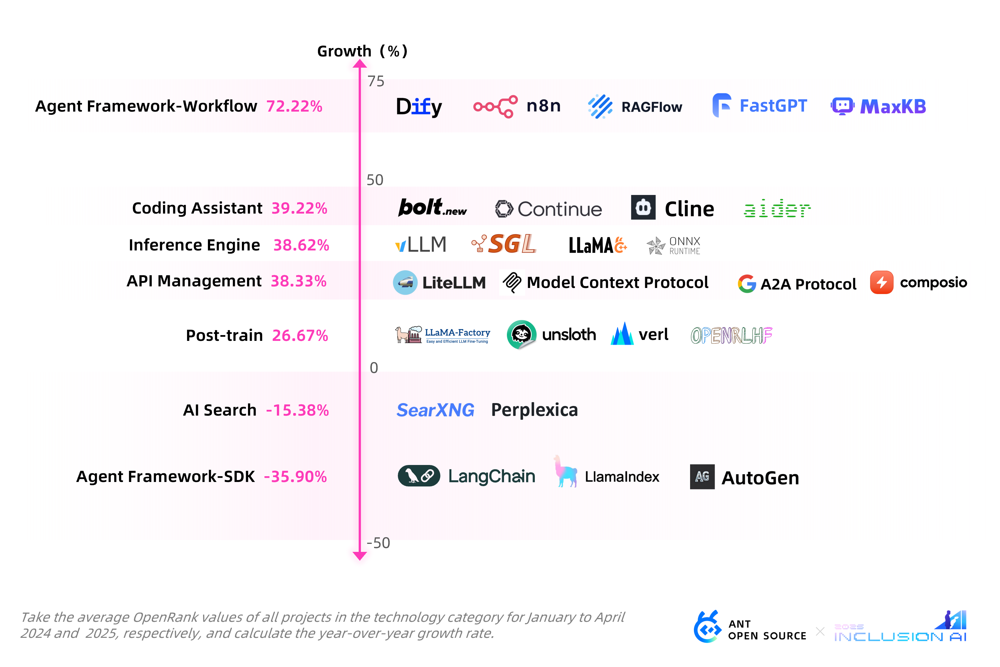

+ **The divergent trajectories of Agent Frameworks:** At the two extremes of this growth spectrum are application platforms like Dify and application development frameworks like LangChain. Though both projects were agentic, their divergence of their approaches and paradigms exemplify the ecosystem's rapid iteration and extraordinary vitality. A special mention is warranted for [DB-GPT](https://github.com/eosphoros-ai/DB-GPT), the open-source project initiated by Ant Group and the only one featured in the ecosystem map: it is an Agentic development platform that integrates AI application development organically into big data application scopes. The project quickly garned attention from academic and industrial developers immediately after its 2023 launch, fostering widespread collaborative participation on the global stage.

+ **The rise of Reinforcement Learning**: DeepSeek-R1’s “Aha Moment” demonstrated the effectiveness of reinforcement learning as a post-training approach. Reinforcement learning frameworks like Verl and OpenRLHF have seen remarkable growth this year. In February, [inclusionAI](https://github.com/inclusionAI/AReaL) fully open-sourced their reinforcement learning framework [AReaL](https://github.com/inclusionAI/AReaL), designed to train large inference models that anyone can reproduce and contribute to. 

+ **The blurring of Technical Boundaries**: The boundaries between ecosystems are being dynamically redefined. For instance, vectorized storage, computation, and retrieval, which are the critical components for integrating domain-specific knowledge into large model applications, has driven a surge in popularity for specialized vector databases like Milvus and Qdrant. Meanwhile, traditional big data systems have also developed or integrated vectorization capabilities. Ant Group’s open-source distributed database [OceanBase](https://github.com/oceanbase/oceanbase) added vector storage support last year and achieved API compatibility with Milvus. The evolving landscape reveals how technological boundaries remain fluid and interconnected, maintaining a delicate ecological equilibrium through continuous convergence and innovation.

****

## Now, the Technical Trends in LLM Open-Source Development Ecosystems
The landscape provided a clear overview of the paradigm shifts in open source ecosystems. Diving deep and analyze the data further and combined with industrial insights from internal experts, we observed and summarized 7 relatively clear technical trends.

These include emerging paradigms, such as **Agent Frameworks**, AI-native communication protocols like **MCP**, and **Coding Agents** in the application-layer. Furthermore, we observed transformations in more traditional areas like data infra as well as model infra. We observed areas with clear new opportunities (e.g., vectorized storage), while others saw significant ecosystem re-adjustment and re-alignment (e.g., model inference services).

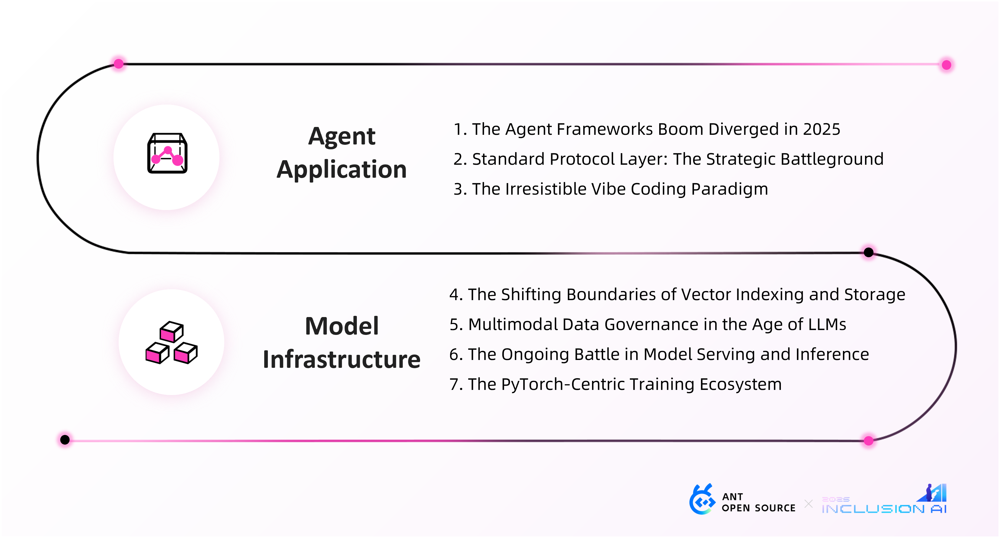

<!-- ### The Agent Frameworks Boom Diverged in 2025 -->
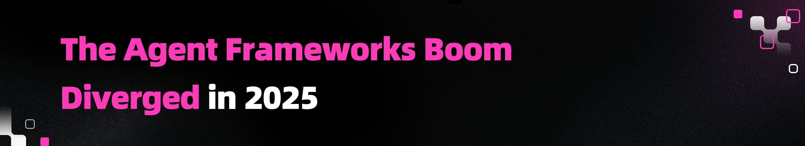

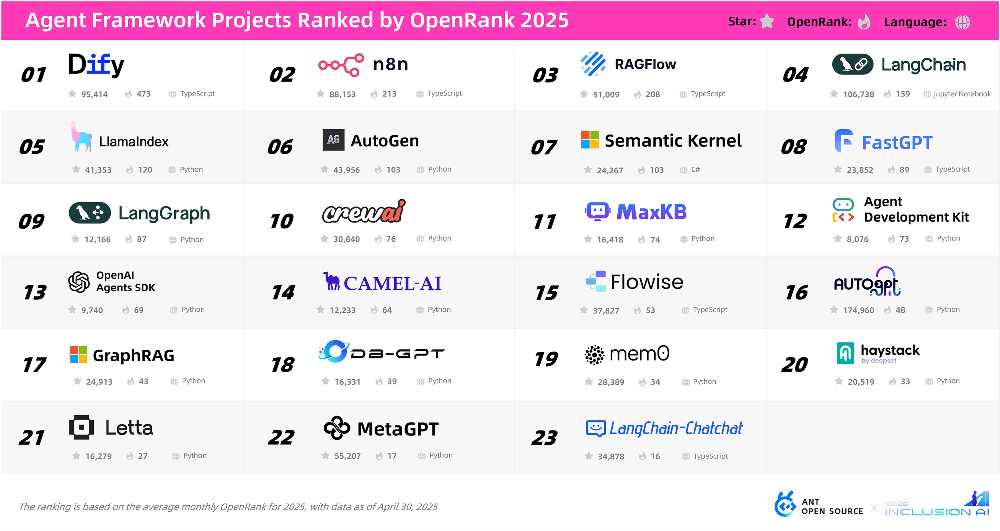

From 2023 to 2024, "all-in-one" frameworks like LangChain dominated the market with their pioneering task orchestration capabilities and rich tool integrations. During this period, we see a huge number of new Agent development frameworks emerged, many focusing on specific features such as tool calling, RAG integration, long-context memory, or ReAct planning. Everyone seems to be hopping into a glorious Odyssey. 

By the second half of 2024, the market landscape had begun to stabilize, and only a few new frameworks enter the ecosystem. As the initial hype faded, we observed that early market leaders like LangChain were gradually declining due to its steep learning curve and high debugging costs. 

Entering 2025, the market began to show signs of divergence: platforms like Dify and RAGFlow became extremely popular by offering a solution with the benefits of low-code workflows and enterprise-grade service deployments. In contrast, development frameworks such as LangChain and LlamaIndex have been steadily losing ground. There's no guanratee that early birds always catches the worm. 

As one of the hottest AI application development platforms today, Dify has accurately captured the needs of enterprise users. It focuses on usability and significantly lowers the technical barrier for amateur users by offering intuitive visual workflow orchestration. Furthermore, it offers comprehensive enterprise-grade security solutions with advanced security and control features. 

In the table below, we compared the functional features of three mainstream frameworks:

| **Feature** | **Dify** | **n8n** | **RAGFlow** |
| :--- | :--- | :--- | :--- |
| Workflow Orchestration Support | ✅ Provides visual AI workflow orchestration, supporting the breakdown of complex tasks into nodes | ✅ Provides visual general-purpose workflow orchestration using a drag-and-drop interface for building automation flows | ⚠️ Partial Support: Focuses on RAG processes; offers a Graph-based workflow primarily for retrieval pipelines. |
| Visual Interface |  ✅ Includes a web-based visual "Canvas" interface for building and testing AI workflows | ✅ Features a web-based visual flow editor (WYSIWYG - What You See Is What You Get) for building workflows | ⚠️ Limited Capabilities: Provides a web interface for document upload and chat interaction, but lacks a general-purpose visual workflow design interface |
| AI/LLM Integration | ✅ Deep integration with various LLMs; supports numerous models (hundreds) and inference providers (dozens) | ✅ Built-in AI nodes support LangChain, calling models like OpenAI, etc.; supports custom code nodes to call any model API | ✅ Integrated LLMs for Q&A; supports multiple major model providers; models are configurable and switchable |
| Document/RAG Pipeline | ✅ Built-in RAG pipeline covering the entire process from ingestion to retrieval; supports automatic text parsing of formats like PDF, PPT | ⚠️ Indirect Support: No native RAG module, but retrieval + Q&A can be implemented via node combinations (e.g., vector database node + AI node) | ✅ Designed specifically for RAG; features deep document parsing (OCR, structure extraction, etc.) + retrieval + citations; provides reliable citation-backed Q&A |
| AI Agent Capabilities | ✅ Supports an Agent framework based on LLM function calling or ReAct; allows adding pre-built / custom tools; includes 50+ built-in tools (e.g., Google Search, DALL·E, WolframAlpha) | ✅ Supports AI Agent flows, enabling LangChain agents to call external services; also allows HTTP nodes to call any API for agent-like behavior | ⚠️ Basic Support: Introduces the "Agentic RAG" concept, allowing external searches (e.g., Wiki, PubMed operators) within retrieval flows; but lacks a general-purpose Agent tool framework |
| Data Processing Capability | ⚠️ Text-Focused: Prioritizes AI-related data processing (prompts, vectors, etc.); supports dataset ETL and template transformation nodes; not designed as a general ETL solution | ✅ Powerful: Handles diverse data types; supports nodes for format conversion, filtering, delays, and custom code for complex logic | ⚠️ Specialized: Focuses on document parsing/processing (layout analysis, table structure extraction, etc.); optimized for knowledge base construction, not suitable as a general-purpose data pipeline |

As AI technology continues to mature, the competition among frameworks has shifted from purely technological innovation to a deeper alignment with real-world business scenarios. Enterprise users began to adopt platforms that offer comprehensive enterprise-grade solutions such as access control, audit trails, data isolation, etc.

It is foreseeable that the future development of AI agent frameworks will exhibit "Matthew Effect": platforms with robust features and well-established ecosystems will attract more enterprise users. Feedbacks from these sophisticated users will further drive real improvements of these platforms, creating a positive feedback loop for evolution. This process favors projects like Dify whcih maintains technical leadership.

<!-- ### Standard Protocol Layer: The Strategic Battleground -->

**2022: The Wild West Era**  
When ChatGPT emerged, early developers experimented with ad-hoc prompt engineering to enable tool interaction - resulting in inconsistent implementations and suboptimal performance.

**2023: First Standardization Attempt**  
OpenAI's GPT4-0613 introduced Function Calling capabilities with more standardized API. However, developers still struggled with multi-function coordination and poor extensibility.

**2024: MCP Changes the Game**  
Anthropic's Model Context Protocol (MCP), open-sourced in November 2024, aimed to standardize agent-tool communication. Benefited from emerged popular agentic products like Manus, by Q1 2025, MCP became the de facto standard with widespread adoption.

**2025: Protocol "War" Begin**

+ In April, Google open-sourced the Agent2Agent (A2A) protocol. Unlike MCP, which focuses on enabling individual agents, A2A establishes standards for communication and interoperability between multiple agents or agentic applications.
+ In May, CopilotKit launched the Agent-User Interaction (AG-UI) protocol, which rapidly gained traction with 2.2K GitHub stars in its first week. AG-UI standardizes the interaction layer between backend tools and frontend user interfaces in agent systems.

The emergence of MCP, A2A, and AG-UI signals a clear trajectory: LLM applications are evolving toward a microservices architecture. We forecast:

+ Specialized Agents/MCPs will be independently deployable services accessible over the internet.
+ Standardized configurations will allow developers or users to locally build and launch services on demand.

This evolution will immediately expose the next round of challenges, including but not limited to traditional microservice challenges (configuration management, version control, security authentication, data privacy, service orchestration) and LLM-specific complexities (GPU elastic scheduling, cross-node context sharing, multimodal coordination, prompt injection defense, output compliance, granular billing, and intelligent quota management).

We might see a wave of new technical protocols and standards coming in focusing on more GenAI native challenges, such as defining metadata standards for large model services, streaming communication protocols, multimodal interaction protocols, service monitoring protocols, and federated inference protocols. The open-source ecosystem will become the battlefield of both standards and their references designs. Successsful trailblazers who dominate standard-setting can leverage protocol advantages to bind developer toolchains (e.g., frameworks, SDKs), thereby forming a closed-loop technical ecosystem from interface specifications to operational practices. This could potentially lead to a significant competitive advantage in the Model-as-a-Service (MaaS) era.

As LLM services accelerate, the standard protocol layer will become a strategic stronghold for leading players. Over the next 1-2 years, we anticipate intense ecosystem positioning struggles before the final consensus can be arrived. Protocols that successfully balance **technical foresight** with **developer experience** will gain dominant influence, driving scalable innovation across the LLM landscape.

<!-- ### The Irresistible Vibe Coding Software Development Paradigm -->

Will developers be the first group to be replaced by AI? This is the question. It was a threat when we first see GitHub Copilot began generating code. The threat was further magnified when AI-powered IDEs started generating entire projects and Cursor's adoption skyrocketed. Then Andrej Karpathy introduced the term "vibe coding" that describes immersive way of writing code using Cursor and natural languages, which seems to have the potential to be "The Trend" in the upcoming productivity domain.

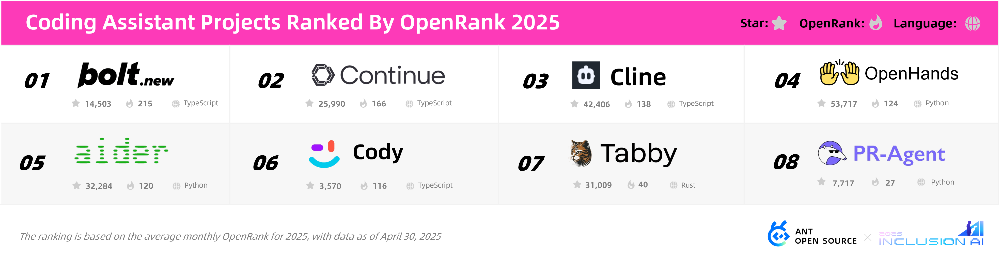

Our extensive research into prominent closed-source AI development tools and leading open-source projects reveals a market pattern:

**Major tech companies have rapidly entered the AI coding space, primarily with closed-source offerings** like GitHub Copilot, Amazon Q Developer, Huawei's CodeArts Snap, Alibaba's Tongyi Lingma, ByteDance's Trae, and Ant Group's CodeFuse. These blue chip companies had a great headstart by leveraging their immense amount of internal deployment data from unique business scenarios. However, there are still challenges associated with proprietary data use and internal processess which might slow down innovation.

**Surprisingly or not, startup ventures and small development teams have demonstrated remarkable agility in producing impactful open-source projects that quickly gain traction within the community.** A prime example is Continue's "continuedev" project, which has garnered substantial attention in open-source circles through lean operations and flexible innovation mechanisms. The AI coding domain is currently still a blue ocean, representing one of the few technical fields where smaller entities can compete effectively against industry giants like OpenAI and Google without being handicapped by their resource disparities. The sector's potential was further endorsed by OpenAI's reported $3 billion acquisition offer for AI development tool Windsurf in early May this year.

When analyzing top GitHub projects along dimensions of intelligence sophistication and target user expertise, we've mapped these trending AI coding projects across four quadrants:

We see **AI coding tools are advancing beyond basic snippet generation to tackle full-scale development workflows**, though substantial challenges remain in achieving production level of engineering excellence. While current leaders like Continue and Cline excel at code completion and basic API calls, they still fall short of being true development agents. 

Existing systems struggle with semantic validation, multi-language coordination, and security-sensitive code generation - particularly when refactoring complex, large-scale codebases where success rates remain disappointing. The path forward requires breakthroughs in Context Awareness and Domain Knowledge Integration. Within two years, advances in code verification (combining formal methods with symbolic execution), multimodal training data (merging code, documentation and runtime logs), and improved developer feedback systems should enable AI coding assistants to handle more routine tasks, though avoiding human oversight will remain crucial for critical decisions.

When enjoying the current prosperity of AI coding tools, it worths drawing our attention to the once-prominent initiatives like Devika, TabNine, and GPT-Pilot. The decline of these projects not only highlights the natural evolution of the AI development landscape but also reveals a deeper market disparity problem, as divergent technical priorities and user needs carve distinct niches within the AI coding behavior. Established commercial products (e.g., GitHub Copilot, Devin, and Cursor) and open-source tools provided too good of an offering that met majority of the user needs, leaving projects with homogenized features or slow iteration (such as Devika and GPT-Pilot) struggling to survive. Meanwhile, prominent open-source projects like GPT Engineer, which later evolved into the commercialized product Lovable through successful open-source practices, have demonstrated successful synergies between open-source innovation and commercialization. Notably, GPT Engineer, once a star project in AI application development, is now abandoned due to the team’s shift in focus, for good.

### 
<!-- ### The Shifting Boundaries of Vector Indexing and Storage -->

The evolution of vector databases can be described as a journey **"from explosive hype to rational consolidation."** Around February 2023, projects like Qdrant and Chroma saw an unprecedented surge in attention, each amassing over 5,000 GitHub stars. However, this initial frenzy **failed to sustain long-term momentum.**

During the overall development period from 2024 to 2025, the attention gained by most projects has stabilized with minimal variation, showing no significant disparities. On the OpenRank trend, Milvus, an early open-source project under the neutral stewardship of the LF AI & Data Foundation, has consistently maintained a stable leading position. Meanwhile, the broader technical landscape appears to function like parallel tracks, advancing steadily forward in unison.

Several factors likely contributed to this equilibrium:

1. **Open-source was not the necessary factor to success:** During this period, closed sourced commercial competitors like Pinecone and KDB.AI were doing equally well. Notably, Pinecone has demonstrated strong product capabilities and robust market expansion, challenging the dominance of open-source alternatives.
2. **Vectorization adaptation in traditional big data systems:** Many traditional databases introduced vectorization plugins or vector search engines (e.g., pgvector) into their core integration. This includes widely adopted databases like PostgreSQL, MongoDB Atlas, OpenSearch, and ElasticSearch. These developments have eroded the competitive advantage of pure vector databases by offering integrated solutions within their established ecosystems.
3. **OpenCore model prioritizes ecosystem expansion over developer metadata:** Similar to traditional databases, vector databases often adopt the OpenCore model, where commercial companies focus less on the core’s community metadata (e.g., GitHub stars, PR counts) and more on building a competitive ecosystem around the core. In this model, a functional and complete open-source core is essential, but its long-term maintenance and community engagement are secondary to the commercial entity’s strategic goals. The true value of open comes from upselling the open source version into their proprietary offerings. Core integrations, ecosystem richness and long term sustainability of the project are the core consideration aspects for upselling.

**The observations led to another discussion:**

**Are vector databases redundant technologies?** Could traditional databases paired with vector search middleware adequately serve the future AI application needs?

The data suggests no. Community data shows that pgvector’s trend is declining, as large-scale models are predominantly deployed in mid-to-large enterprises where horizontal scalability and enterprise-grade capabilities (e.g., cloud-native compatibility, security, and systematic support for existing AI/ML frameworks) are non-negotiable. Commercial products like Zilliz (built on the open-source Milvus) exceled in these areas, offering robust cloud-native architectures, multi-tenancy support, and end-to-end enterprise integration. These commercially supported solutions have gained strong market traction, while pure vector search engines currently lack the depth of the value proposition.

The development trajectories of vLLM and SGLang highlight a critical insight: **technical 'thinness' is not the core failure factor.** In the case of vector-based technologies, the demands, scenarios, and algorithms are highly specific, leaving limited room for innovation in development. Meanwhile, despite the growing volume of unstructured data, better solutions, such as multimodal models or ecosystem players, have yet to reach scale. This lack of breakthroughs results in relatively slow and stable iterative progress in the vector layer’s optimization.

Different from the highly competitive environment at the application layer, the vector database space exhibits remarkable stability. Early innovators haven't been displaced by new disruptors. The waves of change here arrive as swells rather than tsunamis.

<!-- ### The Evolution of Multimodal Data Governance in the Age of LLMs -->

The concept of data lakes emerged during the big data era, addressing the need to store, retrieve, and preprocess multimodal data, while data catalogs fulfilled the requirement for unified management of massive, diverse data assets within data lake and lakehouse architectures. Now, in the era of large language models (LLM), one truth reigns supreme: it's all about the data, the data, and once more, the data. This raises the question: how has the open-source community evolved around technologies and projects governing multimodal, multi-source data during this transformative wave?

In data lake table formats, **Apache Iceberg, Apache Hudi, Apache Paimon**, and **Delta Lake** have formed a "quadropoly" within the lakehouse ecosystem. Iceberg has solidified its position as the universal framework for open-source lakehouses, while Hudi and Paimon excel in real-time incremental processing. Delta Lake continues its steady progress backed by vendor support. These technologies are poised to both compete with and learn from one another, driving continuous advancement in data lake storage to support reliable management of massive unstructured data.

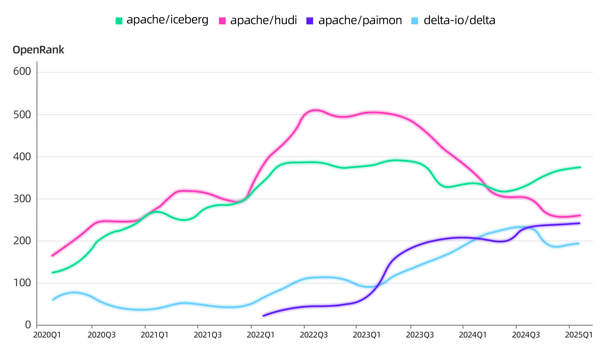

The metadata governance and data catalog space sees **OpenMetadata** and **DataHub** maintaining their leadership with increasingly sophisticated features, while newcomers like **Apache Gravitino** and LF AI & Data's **Unity Catalog** emerge as potential disruptors, hinting at the formation of next-generation unified platforms for data and AI governance. Notably, these tools are expanding their focus to include unstructured data and AI assets, aligning with the broader data governance needs of the LLM era.  

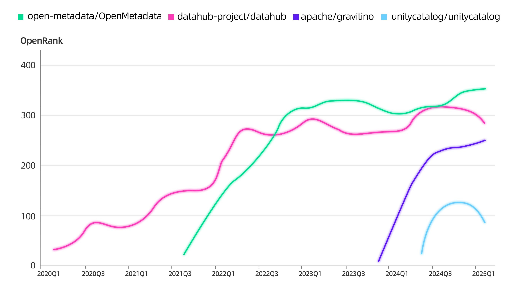

When examining the collaborative networks across all projects in the Landscape, it becomes apparent that big data systems currently occupy a relatively peripheral position in the LLM development ecosystem. This may stem from the inherently less interconnected nature of big data developers compared to their AI counterparts. Nevertheless, this observation underscores that the convergence of big data and AI ecosystems remains a work in progress.

Looking ahead, as foundational models become more deeply embedded within data infrastructure, we may witness tighter integration between these domains, whether through big data projects delivering high-quality data for machine learning tasks, or through models providing intelligent support for data governance. This bidirectional synergy could fundamentally reshape how we approach data management in the age of LLMs.

<!-- ### The Ongoing Horse Racing in Model Serving and Inference -->

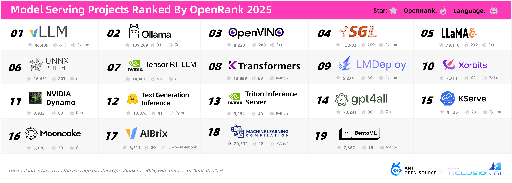

As large language models move into widespread deployment, three critical factors have emerged as the core deal-makers or deal-breakers. They are **inference efficiency, resource utilization, and deployment flexibility**. Since 2023, the market has seen an explosion of model serving tools competing head-to-head over performance and ecosystem expansion velocity, a heated race that shows no signs of cooling. The Top 10 ranking list reshuffles a lot, with new contenders like Tsinghua University's KTransformers (July 2024) and NVIDIA's Dynamo (March 2025) continually challenging the existing status quo.

While it seems to be anyone's game at this moment, we do see a potential duopoly forming in this field:** vLLM and SGLang, currently the two most prominent inference engines in the LLM space**, **converged to be the top choices and was also recommended by DeepSeek.** According to OpenRank trends, the communities of vLLM and SGLang continue to expand. In Q4 2024, vLLM's growth temporarily plateaued, while SGLang experienced rapid iteration, achieving an average OpenRank growth rate of 12% in the same quarter. However, as 2025 began, vLLM released its v1 major version with a core architecture overhaul, reigniting its growth trajectory. This shift triggered a new 'AI arms race' in the inference engine ecosystem: in Q1 2025, vLLM's OpenRank grew at 17%, while SGLang surged to 31%.

This duel carries a notable academic pedigree. UC Berkeley, the birthplace of transformative systems like Spark and Ray, again demonstrates its open-source alchemy from the research institutions: vLLM originated from Berkeley's SkyLab, sharing DNA with its predecessors, while SGLang emerged from LMSYS, a multi-university (including UCB) research consortium that also created the influential benchmark platform Chatbot Arena.

**Community Comparison Between vLLM and SGLang**

|  | **vLLM** | **SGLang** |
| --- | --- | --- |
| **Project Influence (OpenRank)** | 2025 Average: 615 2025 Growth Rate: 17% | 2025 Average: 269 2025 Growth Rate: 31% |
| **Founding Organization** | SkyLab, UC Berkeley | LMSYS, an open research organization co-initiated by UC Berkeley, Stanford, and CMU. |
| **Key Developers** | [DarkLight1337](https://github.com/DarkLight1337), HKUST [youkaichao](https://github.com/youkaichao), Tsinghua [WoosukKwon](https://github.com/WoosukKwon), UCB | [merrymercy](https://github.com/merrymercy), xAI [zhyncs](https://github.com/zhyncs), Baseten [zhaochenyang20](https://github.com/zhaochenyang20), UCLA |
| **Developer Distribution** | United States (33.2%) China (30.8%) | China (49.2%) United States (27.5%) |
| **Community Size** | Contributors: 449 Participants: 12,332 | Contributors: 1,134 Participants: 2,232 |

That said, the model service landscape is **far more diverse than just vLLM and SGLang**. 

**Ollama & llama.cpp: The lightweight Powerhouses for Edge Inference and On-Premise Deployment**

+ A common developer workflow involves using llama.cpp for model training, quantization, and performance tuning, followed by Ollama for rapid deployment and service management. Aside from their recent 1-month rankings as 3rd and 4th in the model service category, they occupy top-tier positions in the broader ecosystem, underscoring their critical role in democratizing AI.

**KTransformers: A Breakthrough for Ultra-Scale Parameter Scenarios**

+ KTransformers generated a huge wave of attention in February 2025 when Tsinghua's KVCache.AI team demonstrated running full 671B parameter models (DeepSeek-R1/V3) on consumer hardware (24GB GPU + 382GB RAM) with 3-28x speedups. The achievement triggered a 34x OpenRank spike, drawing 736 contributors and surpassing 10K GitHub stars within weeks, a testament to the demand for breakthroughs in extreme-scale inference.

### 
<!-- ### The PyTorch-Centric Training Ecosystem -->

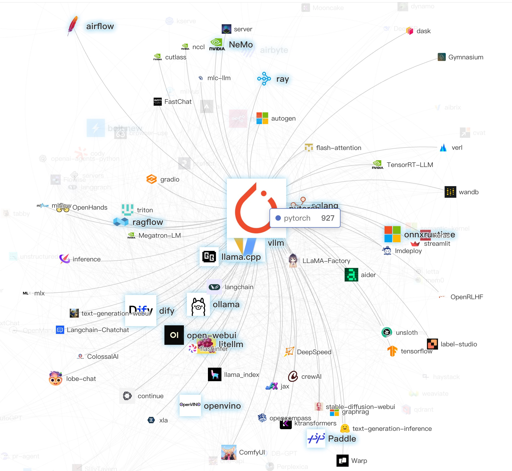

PyTorch has undeniably become the dominant force and de facto standard in today's LLM development landscape. Its modular and lightweight open design propelled it past TensorFlow in 2020, establishing itself as the foundational infrastructure for deep learning in the era of large language models, while frameworks like TensorFlow, MXNet, and Caffe faded into obsolescence.

In September 2022, Meta transferred PyTorch's governance to the Linux Foundation (LF), establishing the PyTorch Foundation as an independent entity. Through PyTorch's nearly overwhelming ecosystem gravitational pull, this sub-foundation has grown into a powerful umbrella organization. In March 2025, the inference engine [SGLang joined the PyTorch ecosystem](https://pytorch.org/blog/sglang-joins-pytorch/); In May 2025, the inference engine vLLM and distributed training platform DeepSpeed also announced their [joining of the PyTorch Foundation](https://pytorch.org/blog/press-release-pytorch-foundation-expands-welcomes-projects-vllm-deepspeed/).

While PyTorch's development is now governed through this neutral, independent foundation, community data still reveals Meta's substantial behind-the-scenes influence. The repository's top contributors include Meta employees: ezyang (3,280 commits), jerryzh168 (1,216 commits), and soumith (1,151 commits), all identifiable as Meta staff on GitHub. At the time of reporting, over 9,000 pull requests (9% of all PRs) carried the "fb-exported" label, which indicates that the code were developed and reviewed internally at Meta before synchronized to GitHub.

****

## Conclusion
Ant Group's Open Source team (with OSPO's job functions and more) initiated this landscape project, with the purpose to understand the full picture of the LLM development ecosystem, including emerging trends and cutting-edge popular projects. One of our missions is to leverage insights from the open-source community to guide Ant Group’s architectural and technological decisions. This landscape and trending analysis aim to provide pivotal guidances to open source technical project selection, with both community highlights and potential pitfalls. 

This report reflects Ant Group's perspective as a technology enterprise, utilizing X-lab's OpenRank evaluation metrics alongside extensive consultations with technical experts and open-source community developers. We deeply appreciate all contributors for their invaluable insights. We welcome collaboration to further enrich these ecosystem observations.

Authors:

Yaya Xia, Richard Bian, Peggy Dong, Xu Wang (AntOSS)

Frank Zhao, Fanyu Han, Jiaheng Peng, Zhen Zhang, Will Wang (X-lab)

Editors:

Richard Bian, Jipei Wang, Lin Zhu

